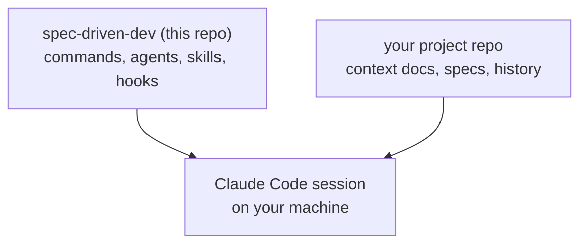
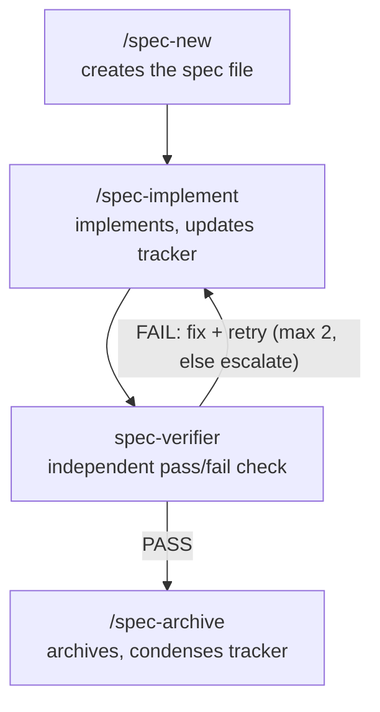

# spec-driven-dev

A Claude Code plugin bundling spec-driven-development commands,
agents, skills, and hooks. Kept out of every application repo on purpose —
this process is versioned independently from the code it governs.

**This repo never contains project-specific instructions.** It provides the
_mechanism_ (commands, agents, skills, hooks, the PR review pipeline). Every
project's own rules, history, and specs live in that project's own repo. See
the diagram below if that split isn't obvious yet.

---

## How this fits together



This repo is pulled in automatically once you trust the project folder — it
never contains anything project-specific. The project repo is read the
normal way Claude Code already works (`CLAUDE.md` found by walking up from
the working directory, `docs/` read on demand). Neither side knows about the
other directly; they only combine inside the session.

Once a session is running, this is the loop the package's commands drive:



`/engineer` (also in this package) is an optional wrapper around this exact
loop — same four stages, one entry point instead of running each by hand.
`/pr-review` is a separate, parallel pipeline that never touches this loop —
it writes to `.reviews/` in the project repo on its own.

---

## What `/spec-archive` hands you at the end

Archiving isn't the last step — it's the handoff back to the human. Two
things come out of it, both generated automatically, neither requiring you
to write anything by hand:

**1. A manual verification script.** The spec's Acceptance Criteria,
translated from EARS notation into concrete, click-by-click actions —
exactly the shape of an E2E test, but meant for you to walk through in the
running app yourself, not for a test runner:

```
Manual verification — Spec 042: request-creation form validation
1. Navigate to /requests/new.
2. Leave "Project name" empty and click "Submit".
3. Expect an inline error: "Project name is required" — form does not submit.
4. Fill "Project name" with "QA test project".
5. Select "GCP" from the "Provider" dropdown.
6. Click "Submit".
7. Expect a confirmation toast: "Request created successfully".
8. Navigate to /requests and confirm "QA test project" appears at the top
   of the list.
```

Criteria that aren't UI-observable (a backend validation rule, a header
check) get translated the same way but with whatever tool fits — curl, an
API client, devtools' network tab — never skipped just because there's no
click to describe. This script is deliberately shaped to be pasted straight
into a PR description's "how was this tested" section, not thrown away
after you run it.

**2. Two separate local commits, already made — not just a suggestion.**
Everything under `docs/` (the archived spec file, the tracker update, the
new verification-log entry, any living-doc update) goes in one commit;
everything else — the actual application code — goes in another. Nothing
is pushed. A reviewer opening the PR later sees one commit that's pure
process and one that's pure code, instead of 20 changed files where only 5
are the feature itself.

```
docs(spec-042): archive — request-creation form validation
feat(requests): validate required fields on request-creation form
```

If a changed file doesn't cleanly sort into either bucket, that's a
stop-and-ask trigger, not a guess to make silently — the same rule that
governs any other unresolved decision.

Run the manual script before you push, not after — if something's off,
you're fixing it against two clean, already-separated commits instead of
one tangled one.

---

## What lives here vs. what lives in each project repo

| This package (`spec-driven-dev`)                                                                                            | Each consuming project's own repo                                                          |
| --------------------------------------------------------------------------------------------------------------------------- | ------------------------------------------------------------------------------------------ |
| `commands/` — `spec-new.md`, `spec-implement.md`, `spec-archive.md`, `hotfix.md`, `learn.md`, `pr-review.md`, `engineer.md` | `CLAUDE.md`, `AGENTS.md`                                                                   |
| `agents/` — `explorer.md`, `spec-verifier.md`, `pr-reviewer.md`                                                             | `docs/context/01`–`06`                                                                     |
| `skills/` — `subagent-dispatch/`, `mock-first-api/`                                                                         | `docs/specs/` (per-developer folders), `docs/specs/_template.md`, `_amendment-template.md` |
| `hooks/` — Context7 key check, any agent-side enforcement `learn.md` proposes                                               | `docs/specs/archive/`, `docs/verification-log/`                                            |
| `pr-review/` — `cli.mjs` + ~15 modules, fixtures, golden files, tests                                                       | `.husky/` (pre-commit/pre-push — human-edit-side enforcement; can't live in a plugin)      |
| `system-one/decide.mjs` — optional Laya/Jev decision helper, never required                                                 |                                                                                            |

---

## Dependencies (auto-installed with this plugin)

| Plugin        | Marketplace               | Source                           |
| ------------- | ------------------------- | -------------------------------- |
| `superpowers` | `claude-plugins-official` | built in, no setup needed        |
| `context7`    | `claude-plugins-official` | built in, no setup needed        |
| `ponytail`    | `ponytail`                | `github:DietrichGebert/ponytail` |
| `i-have-adhd` | `i-have-adhd`             | `github:ayghri/i-have-adhd`      |

Enabling `spec-driven-dev` enables all four automatically.

---

## Optional acceleration: the System One decision helper

Separate from the plugin dependencies above — this isn't a Claude Code
plugin, just an optional classifier a few commands can call for cheap,
structured micro-decisions: model tiering, skill matching, mechanical-diff
detection, PR triage. `system-one/decide.mjs`, bundled in this package,
tries in order:

1. **Laya**, local, if `LAYA_ENDPOINT` responds (default
   `http://127.0.0.1:8765`).
2. **Jev**, hosted, only if `TYPESAFE_API_KEY` is set.
3. Neither → returns `{available: false}` immediately, short timeout.

Every call site follows the same rule: use the decision if one comes back,
decide it yourself exactly as before if it doesn't. **Nothing in this
package may ever assume either is present** — this is a speed/cost
optimization, never a correctness dependency. Setting either up is entirely
optional and outside this package's scope (Laya needs local weights and a
runtime; Jev needs an API key) — deliberately not part of the one-time
setup checklist, because nothing here requires it.

---

## Do / don't

- **Do** trust the project folder before anything else — that's what
  triggers marketplace registration and plugin install from
  `.claude/settings.json`.
- **Do** turn on auto-update for `yourorg-spec-driven-dev` once, via
  `/plugin` — we don't pin versions, so this is what makes a push actually
  reach you.
- **Do** run one real, small feature through the full pipeline before
  treating a new project's setup as done.
- **Don't** recreate `.claude/commands/`, `.claude/agents/`, or
  `.claude/skills/` inside a project repo — this package provides them;
  a local copy just drifts out of sync and causes duplicate/conflicting
  triggers.
- **Don't** manually create `docs/specs/<developer>/`, `docs/specs/archive/`,
  or `docs/verification-log/` — the commands create these on first use.
- **Don't** edit anything under `~/.claude/plugins/cache/` directly — it's
  overwritten on the next update. Edit this repo and push instead.
- **Don't** pre-populate a project's "Things Flagged as Uncertain" section
  with guesses. Seed it only with facts that are already true (see the
  bootstrap prompt below for exactly which three), everything else comes
  from `/learn` the first time something actually surprises someone.
- **Do** run the manual verification script `/spec-archive` hands you
  before pushing — it's generated from criteria that already passed the
  automated check, so it's a cheap final look, not redundant busywork.
- **Don't** squash the two commits `/spec-archive` creates back into one
  before pushing. The doc/code split is the whole point — it's what lets a
  reviewer skip the process commit entirely if they trust it.
- **Do** treat the System One decision helper as pure acceleration — every
  call site needs a working fallback for when it's unavailable, not just a
  try/catch that fails loudly.
- **Don't** add a new call site for `decide.mjs` without writing its
  "decide it yourself" fallback in the same change. An accelerator with no
  fallback is a hard requirement wearing a disguise.

---

## One-time setup, per developer machine

- [ ] Trust the project folder in Claude Code.
- [ ] Turn on auto-update for `yourorg-spec-driven-dev` via `/plugin`.
- [ ] _(Optional)_ Context7 API key — get one at
      [context7.com/dashboard](https://context7.com/dashboard), export
      `CONTEXT7_API_KEY` in your shell profile, restart Claude Code. Skippable;
      falls back to the anonymous rate limit, and a `SessionStart` hook
      reminds you if it's unset.
- [ ] _(Only if you'll run `/pr-review`)_ `npx playwright install chromium`
      once — needed for screenshot capture, not installed automatically.

---

## Bootstrapping a new project

### 1. Wire up the plugin

Create `.claude/settings.json` in the new repo, commit it, then trust the
folder:

```json
{
  "extraKnownMarketplaces": {
    "yourorg-spec-driven-dev": {
      "source": { "source": "github", "repo": "yourorg/spec-driven-dev" }
    },
    "ponytail": {
      "source": { "source": "github", "repo": "DietrichGebert/ponytail" }
    },
    "i-have-adhd": {
      "source": { "source": "github", "repo": "ayghri/i-have-adhd" }
    }
  },
  "enabledPlugins": {
    "spec-driven-dev@yourorg-spec-driven-dev": true
  }
}
```

### 2. Create the governing docs

This package does not provide these — they're project-specific by design.
**Don't write these by hand.** Paste the block below into a fresh Claude
Code session, in the new project's root, after step 1:

```text
You are bootstrapping the governing documentation for a brand-new project
that will use the spec-driven-dev Claude Code plugin (already installed via
.claude/settings.json). This repo has no prior history — do not invent
non-obvious patterns, invariants, or architecture decisions. Only record
what is genuinely already true.

Before writing anything, ask me these questions, one at a time, and wait for
my answers:
1. What is this project? (one or two sentences: purpose, primary users)
2. What's explicitly out of scope for now?
3. What's the core tech stack? (framework, state management, styling,
   testing tools — say "not decided yet" for anything open)
4. Does this project have a UI, or is it backend/library/CLI only?
5. Are we adopting the dual enforcement layer (Husky pre-commit/pre-push,
   alongside this plugin's own agent-side hooks)?

Once I've answered, create the following. Follow the tiered pattern
throughout: each file's core content (invariants, universally-true rules)
stays short; anything detailed or subsystem-specific goes in a separate,
linked file read only when relevant — never inline everything "just in
case."

1. CLAUDE.md — one line, "@AGENTS.md", plus a one-line note that
   commands/agents/skills/hooks come from the spec-driven-dev plugin, not
   this repo.

2. AGENTS.md — the shared rulebook: a "read this first" list pointing to
   docs/context/01-06 (05 conditional on UI work), and the spec-creation
   convention — /spec-new derives the developer's folder from
   `git config user.name` (slugified): docs/specs/<developer>/00X-name.md,
   numbered per-developer, never globally. Include build/test commands from
   my stack answers.

3. docs/context/01-project-overview.md — purpose, users, explicit non-goals,
   from my answers. Short — this is always-loaded core.

4. docs/context/02-architecture.md — short core only: real stack facts I
   gave you, plus a "Things Flagged as Uncertain" section seeded with
   exactly these three, since they're already true today, not speculation:
   - Commands/agents/skills/hooks live in the external spec-driven-dev
     plugin, not this repo — don't recreate .claude/commands/ locally.
   - Spec numbering is scoped per-developer folder, not one global sequence.
   - The plugin marketplace auto-updates — a stale-looking cached plugin
     isn't a bug to hand-fix locally.
   Add nothing else here. Everything else gets discovered and added via
   /learn as the project actually runs.

5. docs/context/03-code-standards.md — naming/lint/format rules from my
   stack answers. If I said "not decided," leave a stub noting that; don't
   invent conventions.

6. docs/context/04-ai-workflow-rules.md — the full rule set, written
   complete, not phased in:
   - One spec at a time; concurrent work uses separate git worktrees, never
     the same working tree.
   - Read the progress tracker in full before starting any spec.
   - Stop and ask — never guess — when the spec and 02-architecture.md
     don't resolve a decision. Authority order: spec > 02-architecture.md >
     other context docs > existing code > generated docs.
   - Only an independent check (spec-verifier or a human) can mark a spec
     Completed. A FAIL keeps it at Awaiting Verification; an automatic
     fix-and-reverify loop is capped at two attempts before escalating to a
     human. The verifier's own job is narrow and deliberately not
     mechanical: typecheck, tests, and build run as plain commands and cost
     no LLM tokens at all — the verifier confirms the EARS criteria's test
     coverage actually matches what was asked, and reads the diff for
     anything genuinely not mechanically testable.
   - /hotfix forks on triage: a regression gets logged and fixed under a
     [HOTFIX-<id>] tag with same-commit removal discipline once resolved;
     a request that's actually a new requirement gets redirected to
     /spec-new instead of hot-fixed in place.
   - Never weaken a test to make it pass.
   - /learn escalation: a one-off gap gets a doc correction; a mistake
     flagged twice proposes an enforcement mechanism instead — branching
     explicitly on agent-side (a Claude Code hook, lives in the plugin) vs.
     human-edit-side (a Husky script, lives in this repo's .husky/) — never
     assume one location for both.
   - Non-trivial tooling discoveries (>10 min of trial-and-error) get
     captured as a skill in .claude/skills/ in this repo before moving to
     Awaiting Verification — local staging, promoted into the plugin
     package in a later release, not written directly into the package.
     Promotion is a deliberate moment, not an ordinary commit: re-run the
     package's own test suite once more as the "am I sure" check, then tag
     the commit spec-driven-dev--v{next} (the {plugin-name}--v{version}
     format Claude Code's plugin system already resolves) so the promotion
     leaves an addressable checkpoint behind.
   - New specs start from clarifying questions or a guided brainstorm, never
     hand-written straight from a rough idea for anything non-trivial.
   - Completed specs are immutable — changes go through a numbered amendment
     spec; multi-hop amendment chains point their forward-pointer at the
     original spec, never an intermediate one.
   - /spec-archive condenses a Completed entry to 1-2 lines and moves the
     full narrative to docs/verification-log/<developer>-<number>-<name>.md,
     as one atomic step with the file move and living-doc update.
   - /spec-archive's final output, as part of that same atomic step: (a) a
     manual verification script translating the spec's Acceptance Criteria
     into concrete click-by-click actions for a human to run before
     pushing, shaped to double as PR description content; (b) the working
     tree split into two separate local commits, never pushed automatically
     — everything under docs/ in one commit, actual application code in
     another. A file that doesn't cleanly sort into either bucket is a
     stop-and-ask case, not a guess.
   - Orchestrated implementation (/engineer): work is decomposed into
     dependency-ordered waves, each wave's subspecs dispatched to separate
     workers in isolated git worktrees with no shared files — a worker
     never writes a file another worker in the same wave owns. A spec
     that's large but sequential stays a single implementation, not a
     forced decomposition, and a subspec small enough to just do inline
     never gets dispatched — dispatch overhead isn't free. If a later wave
     reveals an earlier wave's contract was wrong, the orchestrator updates
     the contract (not the parent spec's EARS criteria, which describe the
     requirement, not the orchestrator's translation of it), re-dispatches
     affected downstream workers, and logs the correction — never silently.
     If the issue traces back to a genuine misunderstanding of the
     requirement itself, not just the decomposition, escalate to the human
     instead, the same as unresolved ambiguity.
   - /engineer's default roles: Sonnet at high effort for the orchestrator
     (the one serial, high-leverage step — a wrong decomposition corrupts
     every worker built against it), Haiku for workers, Sonnet at medium
     effort for the verifier — a starting point to validate empirically
     against real metrics, not a fixed rule. Before dispatching, the
     orchestrator surfaces its planned wave/worker count as a sanity check
     against runaway fan-out; the whole run is capped by a token/time
     budget that pauses and escalates to a human rather than continuing
     unsupervised past it. Metrics (tokens, time, waves, workers, retries,
     final verdict) are captured per run and logged into
     docs/verification-log/ alongside the spec's own entry.
   - Model-tiering, skill-matching, mechanical-diff, and PR-triage
     decisions may optionally call this package's system-one/decide.mjs
     helper for a fast, cheap answer. Never required — every one of these
     decisions has a normal, judgment-based fallback, and nothing may
     assume the helper is present.

7. docs/context/05-ui-context.md — only if I said this project has a UI.
   Design tokens and component conventions from my stack answers; otherwise
   skip this file entirely.

8. docs/context/06-progress-tracker.md — just the section headers: In
   Progress / Awaiting Verification / Completed / Deprecated-Removed, each
   empty. No pre-adoption backfill — there's no prior history.

9. docs/specs/_template.md — EARS-format spec template: Goal, Design
   Decisions, Implementation Details, Dependencies, Acceptance Criteria
   (EARS notation), Verification Checklist.

10. docs/specs/_amendment-template.md — same shape, scoped to
    Added/Modified/Removed relative to the spec it amends, with an Amends:
    field pointing at the original.

11. If I said yes to the dual enforcement layer: scaffold
    .husky/pre-commit and .husky/pre-push running checks that match my
    stack answers, and wire package.json's prepare script.

Do not pre-create docs/specs/<developer>/, docs/specs/archive/, or
docs/verification-log/ — those come into existence the first time /spec-new
or /spec-archive actually runs. Show me the full file list you're about to
create before writing anything, and stop for my confirmation.
```

### 3. Validate before treating it as "the standard"

Run one real, small, bounded feature through the full pipeline —
`/spec-new` → `/spec-implement` → `spec-verifier` → `/spec-archive` — and
confirm concretely, don't assume. Treat this pass as the system's first
real feedback loop, not a formality to clear — iterating on the rules
themselves here is expected, not a failure:

- [ ] The progress tracker entry condensed to 1–2 lines on archive, with the
      full narrative moved to `docs/verification-log/`.
- [ ] A self-applied fix after a verifier FAIL correctly required a second,
      independent pass rather than self-certifying.
- [ ] If Husky is set up: a deliberately-introduced issue is caught by
      _both_ the agent-side hook and the human-edit-side Husky check.
- [ ] With neither Laya nor Jev configured, a tiering or triage decision
      still completes correctly on the agent's own judgment — the helper's
      absence should be invisible to the outcome, not just non-fatal.
- [ ] Run the same feature (or a second small one) through `/engineer` end
      to end instead of the commands by hand — the first real exercise of
      the orchestrator/worker/verifier pipeline, including at least one
      multi-subspec wave if the work genuinely parallelizes.
